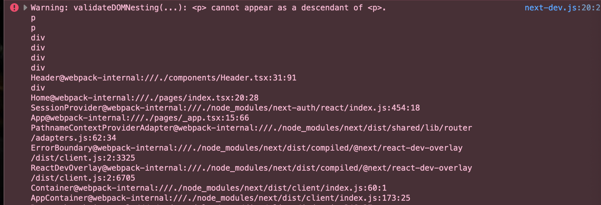

### Problems Faced

-   During the execution of Next auth I was constantly gettin error on "Hydration failed because the initial UI does not match what was rendered on the server." After closer inspection on the error message i found that it was this 'p cannot appear as a descendant of p.

[Josh W. Cameau](https://www.joshwcomeau.com/react/the-perils-of-rehydration/) has a great article on this.

-   When i was implementing the delete function in cart page for some reason redux wasnt deleteing it from the store after some research i fond a very good solution form [stackoverflow](https://stackoverflow.com/questions/67436949/removing-a-value-from-an-array-using-redux-toolkit)

-   While implementing stripe i was getting an error of CORS origin not allowed. Which prevented the page to redirect to the checkout page in stripe. After some research i found a solution in [Stack Overflow](https://stackoverflow.com/questions/71525152/cors-error-while-performing-stripe-checkout)

### Resources

-[Removeing carousel Thumbnail](https://stackoverflow.com/questions/64358616/how-can-i-remove-the-part-below-the-carousel)

-[The Perils of Rehydration - Josh W. Cameau](https://www.joshwcomeau.com/react/the-perils-of-rehydration/)

-[Removing a value from an array using redux toolkit](https://stackoverflow.com/questions/67436949/removing-a-value-from-an-array-using-redux-toolkit)
