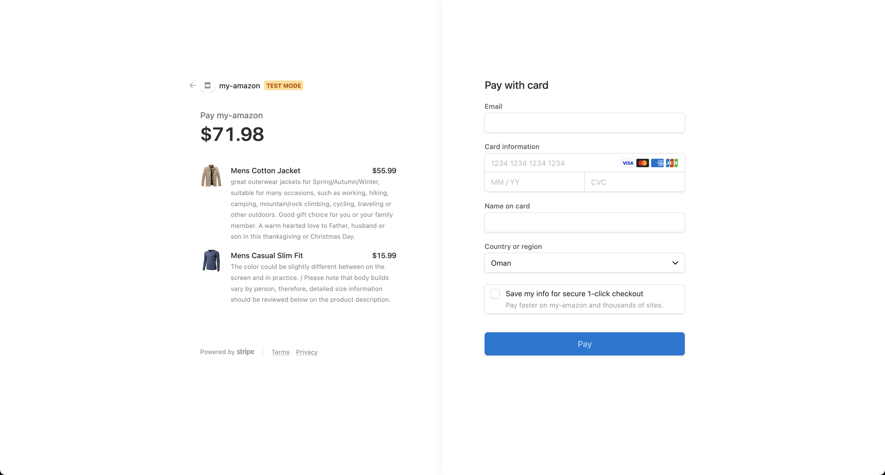
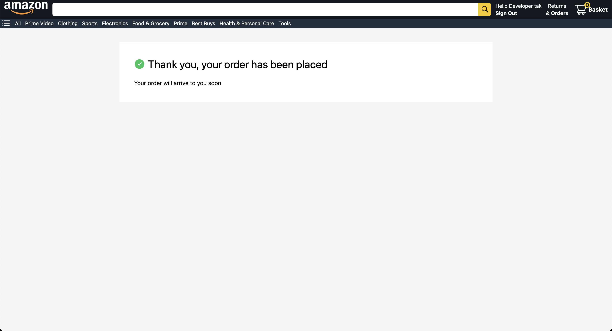

# Amazon

## Next-js, Redux, Stripe

 
 

An "Amazon clone" built using Next.js, Tailwind CSS, NextAuth, Redux, and GraphQL with Stripe API which makes it a highly functional, fast, and dynamic e-commerce website that closely mimics the features and user experience of the original Amazon website. Next.js is used to handle the server-side rendering of the website, which would make it highly performant and SEO-friendly. Tailwind CSS is used for the styling of the website, providing a consistent and modern design. NextAuth is used to handle user authentication and authorization, allowing users to log in and register securely. Redux is used to manage the state of the website, ensuring that all data is handled efficiently and consistently. GraphQL is used as the API for the website, providing a flexible and efficient way to retrieve and manipulate data. And Stripe API is used to handle payment processing, allowing customers to make purchases on the website.

[Live Demo](https://amazon-next-app-zqtc.vercel.app/)

## Skills Aquired

-   Redux Toolkit
-   Stripe

### Problems Faced

-   During the execution of Next auth I was constantly gettin error on "Hydration failed because the initial UI does not match what was rendered on the server." After closer inspection on the error message i found that it was this 'p cannot appear as a descendant of p.

[Josh W. Cameau](https://www.joshwcomeau.com/react/the-perils-of-rehydration/) has a great article on this.

-   When i was implementing the delete function in cart page for some reason redux wasnt deleteing it from the store after some research i fond a very good solution form [stackoverflow](https://stackoverflow.com/questions/67436949/removing-a-value-from-an-array-using-redux-toolkit)

-   While implementing stripe i was getting an error of CORS origin not allowed. Which prevented the page to redirect to the checkout page in stripe. After some research i found a solution in [Stack Overflow](https://stackoverflow.com/questions/71525152/cors-error-while-performing-stripe-checkout)

### Resources

-[Removeing carousel Thumbnail](https://stackoverflow.com/questions/64358616/how-can-i-remove-the-part-below-the-carousel)

-[The Perils of Rehydration - Josh W. Cameau](https://www.joshwcomeau.com/react/the-perils-of-rehydration/)

-[Removing a value from an array using redux toolkit](https://stackoverflow.com/questions/67436949/removing-a-value-from-an-array-using-redux-toolkit)

### Screenshots

